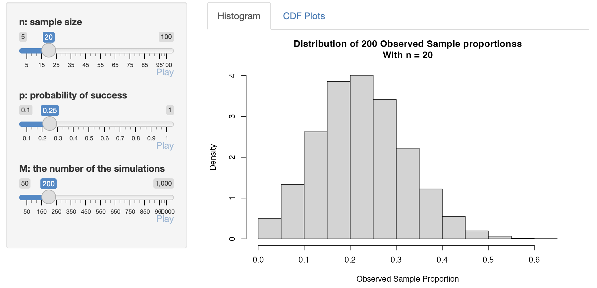

```{r, include=FALSE}
knitr::opts_chunk$set(results = 'asis',
                      echo = FALSE,
                      warning = FALSE,
                      tidy = FALSE,
                      message = FALSE,
                      fig.align = 'center',
                      out.width = "100%",
                      cache = TRUE)
options(knitr.table.format = "html") 
```

##  Motivation and Goals

Based on years of teaching the difficult topics of convergence to both intro and advanced audiences, we've developed interactive visuals and exploration activities to help students understand the intuition behind these ideas and how to apply the results. Specifically:

- Two commonly taught convergence concepts: 'in distribution' and 'in probability' are demonstrated through the use of interactive Shiny Applications
- These tools allow for multiple random sequences with known features to be simulated and the behavior changes of the random sequences to be explored
- Users can take advantage of these visualizations without needing knowledge of any programming language

## Exploring Convergence in Distribution 

The `ExploringConvergenceInDistribution.Rmd` file can be downloaded and run in RStudio (see QR code link for details). This file can be used for an introductory course or a more advanced course. 

- Convergence in distribution is **introduced through sampling from a Binomial**
- An activity allows students to try to **develop a rule of thumb** for when the **CLT is appropriate when sampling from a Gamma distribution**
    + Convergence is looked at via histograms and comparisons of relevant CDFs
- A general convergence app allows students to explore sampling from 10 common distributions and observe the sampling distributions of seven different statistics 

<!-- ## CLT Applied to a Binomial Sample Proportion -->

<!--  -->

## Gamma Convergence Example


## Exploring Convergence in Probability

The `ExploringConvergence.Rmd` file can be downloaded and run in RStudio (see QR code link for details). This file is only appropriate for a more advanced course. 

- Convergence in distribution is discussed in a similar way to the previous file
- Convergence in probability of the **sample proportion to the true proportion** is investigated using simulations of different sample sizes
- Convergence in probability is explored visually through similar graphs
- An activity to **guess what a particular statistic converges to** allows the students to use their prior knowledge to make an educated guess and observe convergence in probability intuitively


## Visualizing Convergence in Probability

For $Y_i\stackrel{iid}\sim N(0,1)$, convergence of $X_n = \frac{1}{n^2}\sum_{i=1}^{n}Y_i$ is explored visually

 

## Educated Guessing at Convergence

Using $Y\stackrel{iid}\sim N (10,1)$, $W = (\bar{Y})^2$ is investigated


## Additional Resources

Available at 
<a href = "https://github.com/XiaoxiaChampon/ConvergenceConcepts/tree/master" style = "color:blue;">Github</a> (or use the QR code)